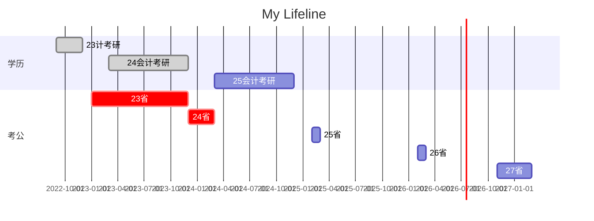

## 时间管理

我的目标变化
小学：画家，发明家，科学家
初中：生物学家，人文地理学家
高中：心理学家，对外汉语教师，中华文化的传播者
大学：电子商务领域的专家，程序员（web前端，Python），电商运营
现在：体制内，会计，审计，MBA，MPA

## 四大事

### 关系：圈子

### 技能：python，GPA，英语，电商

### 财务：月入过万，结余一半

### 业余：编程，二胡，钢琴，小说

准备把自己这段人生想做的事情全部写下，写完，那也就死而无憾了。

- [ ] 公务员纸质资料全部做完
 
- [ ] 学习并清理完百度网盘的学习资料
 
- [ ] 坚持背单词一年

- [ ] 不背单词单词清零
 
- [ ] 考研上岸

- [ ] 事业编上岸

- [ ] 公务员上岸

- [ ] 找到工作

- [ ] 月入过万

- [ ] 个人网站实现番茄钟功能

- [ ] 个人网站实现多个进度条功能

- [ ] 个人网站实现文章管理功能

- [ ] 个人网站实现标签词云

- [ ] 个人网站实现记账功能

- [ ] 个人网站实现数据可视化看板

- [ ] 发布个人网站

- [ ] 购买一个midi键盘

- [ ] 学会弹卡农

- [ ] 发布自己的一首纯音乐钢琴曲

- [ ] 发布一首完整的纯原创歌曲

- [ ] 买一个二胡

- [ ] 学会拉二泉映月

- [ ] 拥有自己的一项可盈利的专利

- [ ] 经营一个有稳定月销量的网店

- [ ] 出版一本书

- [ ] 炒股

- [ ] 买国债

- [ ] cpa证书

- [ ] 心理咨询师证书

- [ ] 中职电子商务教师证

- [ ] 导游证

- [ ] 计算机二级

- [ ] 翻译证书

## 手机管理

1. 时钟
2. 日历
3. obsidian
4. 微信
5. 青柠记账
6. WPS
7. 支付宝
8. 淘宝，京东，拼多多

## 电脑管理

## 一年一句

00 活着，就已经很幸运了

01 人的出生。可能只是一个意外

02 小孩子真好，不用说话就可以得到想要的

03 我把东西埋起来，再挖出来，这不是幼稚，我感受的，是挖出时的惊喜，挖不到的失落。

04 夏天晚上，第一次在凉爽的屋顶看星星，天那么高，我不害怕；屋顶那么低，我却不敢站起来。

05 在幼儿园最美的就是吃完小熊饼干，喝完糖水，再和小朋友们一起睡大觉。

06 骑着姥姥的三轮车，吃力低蹬上土坡，再滑下来，蹬上时有多累，滑下时就有多爽。

07 我在门口等妈妈回家，生怕空中盘旋的蝙蝠吸我的血。

08 坐在花坛边，等待放学响铃，总觉得自己是跑最快的。

09 爬墙头，摘杨树叶挂在头上当特种兵，县里植物园一定是很好玩的地方吧。

10 弟弟年龄小，事还多，一直和我们抢东西，我们不带他玩。

11 北京的楼修那么高不会倒吗，都不敢在下面站着，莲子是什么，我也想吃啊！

12 她写字怎么那么好看，一定是握笔的关系，我一定要学她的握笔姿势。

13 为什么上初中还要找关系花钱，他们就爱拉帮结派，厕所抽烟，教室打架。

14 衡中模式真是名不虚传，可为什么大锅饭那么难吃还要一个月320。

15 补课是强制的，80人挤在老师家中，在学校怕被抓，菜是自养的，纯天然无公害，还有人吃出了蜗牛。

16 这家伙一点人情味都没有，我对他都那么热情了。

17 发自内心地说，你选文科是不是为了逃避数学？不，我是为了学地理。那我认为这是你做得最错误的决定。

18 最喜欢的，当然是学习累了，看看学校的晚霞。

19 不是你选择的大学，不是你选的专业，是你考的分数。

20 大学是一个社会，什么都要自己争取，一堕落就可能真的堕落了。

21 那个班干部赚了很多钱，给对象和自己一人买了个苹果手机。

22 任何有面试的，都不可能绝对公平，大部分的人生，从一开始就被决定了，我真的觉得上学就是为了延迟就业。

23 一个人，若是习惯了安逸，便失去了活力，接受了命运。毕业后，我俨然成为一个废人，在家里以备考的名义啃老，混吃等死。

